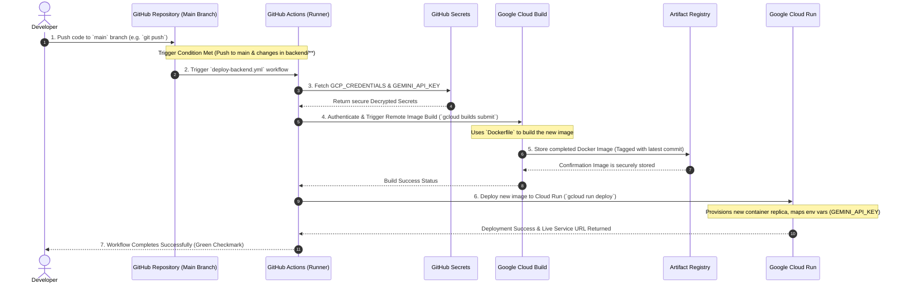

# Continuous Deployment (CD) Explained

This document provides a visual and step-by-step breakdown of how Continuous Deployment (CD) works for the CineScope backend. This pipeline ensures that every time code is merged into the main tracking branch, it is automatically built, tested, and deployed to production on Google Cloud Run without manual intervention.

## The CI/CD Pipeline Visualized

## Step-by-Step Breakdown

### 1. Code Push (The Trigger)
The entire process begins when a developer commits code and pushes it to the `main` branch on GitHub. The workflow strategy (`deploy-backend.yml`) dictates that the build process is only triggered if files within the `backend/` directory have been modified.

### 2. Workflow Initialization (GitHub Actions)
GitHub provisions a fresh Ubuntu Linux runner (virtual machine) to execute our workflow steps. The runner checks out our repository code to have the latest environment setup.

### 3. Identity and Access Management (Authentication)
Security is critical in CI/CD. The runner extracts our `GCP_CREDENTIALS` from GitHub's encrypted secrets manager securely. Those credentials correspond to a "Service Account" inside Google Cloud, acting as a robot developer. The runner uses these credentials to authenticate itself with Google Cloud APIs. 

### 4. Continuous Integration / Build (Google Cloud Build)
The workflow sends a command to Google Cloud Build. Instead of downloading Docker locally on the runner, Cloud Build takes our `Dockerfile` and source code and builds the container directly alongside Google's infrastructure. It installs our dependencies (`npm ci --omit=dev`) and bundles everything securely. 

### 5. Image Storage (Artifact Registry)
Once the image completes the build process, it is automatically pushed to Google Cloud Artifact Registry. This registry serves as a private repository holding our production-ready Docker containers.

### 6. Continuous Deployment (Google Cloud Run)
Finally, GitHub Actions tells Google Cloud Run to update our live service. It points Cloud Run to the newly stored image inside the Artifact Registry. Cloud Run safely spins up the new container instance, passes in our environment variables (e.g., our `GEMINI_API_KEY`), seamlessly routes web traffic to the new version, and finally decommissions the old container. 

The developer can view the success directly from the GitHub Actions dashboard!
